# HIMAYA - System Architecture

## High-Level Architecture

```mermaid
flowchart TB
    subgraph "User Interface Layer"
        A[📱 Basic Phone<br/>IVR/USSD]
        B[📱 Smartphone<br/>PWA/Web App]
        C[💬 WhatsApp<br/>Bot Interface]
    end

    subgraph "API Gateway"
        D[🔀 Load Balancer<br/>nginx/AWS ALB]
        E[🛡️ Rate Limiter<br/>Express Middleware]
    end

    subgraph "Application Layer"
        F[🎤 Voice Service<br/>STT/TTS Processing]
        G[📋 Scheme Service<br/>CRUD Operations]
        H[👤 User Service<br/>Registration/Auth]
        I[🌐 Language Service<br/>i18n/Translation]
    end

    subgraph "Data Layer"
        J[(📊 Scheme DB<br/>JSON/SQLite)]
        K[(👥 User DB<br/>JSON/SQLite)]
        L[📦 Cache<br/>In-Memory/Redis]
    end

    subgraph "External Services"
        M[📞 Telephony<br/>Twilio/Exotel]
        N[🗣️ Speech API<br/>Google/Azure]
    end

    A --> D
    B --> D
    C --> D
    D --> E
    E --> F
    E --> G
    E --> H
    F --> I
    G --> J
    H --> K
    F --> L
    G --> L
    F --> N
    A -.-> M
    M -.-> F
```

## Component Details

### 1. User Interface Layer

| Channel | Technology | Target Users |
|---------|-----------|--------------|
| IVR | Twilio/Exotel Voice | Basic phone users |
| USSD | Telecom Gateway | Feature phone users |
| PWA | Web Speech API | Smartphone users |
| WhatsApp | WhatsApp Business API | Messaging users |

### 2. Voice Processing Pipeline

### 3. Offline-First Architecture

**Cache Strategy:**
- **Schemes**: Cache-first, background sync
- **User Data**: Network-first with fallback
- **Static Assets**: Cache-first, versioned

## Technology Stack

| Layer | Technology | Justification |
|-------|-----------|---------------|
| Runtime | Node.js 18+ | Async I/O, large ecosystem |
| Framework | Express.js | Lightweight, flexible routing |
| Database | JSON/SQLite | Simple for prototype, upgradeable |
| Voice (Dev) | Web Speech API | No API keys, built-in browser support |
| Voice (Prod) | Google Cloud Speech | Best accuracy for Indian languages |
| PWA | Vanilla JS + Service Workers | No build step, maximum compatibility |
| Caching | In-memory (→ Redis) | Start simple, scale when needed |

## Scalability Roadmap

## Security Considerations

1. **Data Privacy**: All PII encrypted at rest
2. **API Security**: Rate limiting, API key authentication
3. **Voice Data**: Not stored, processed in-memory only
4. **Compliance**: Aligned with India's DPDP Bill 2023
