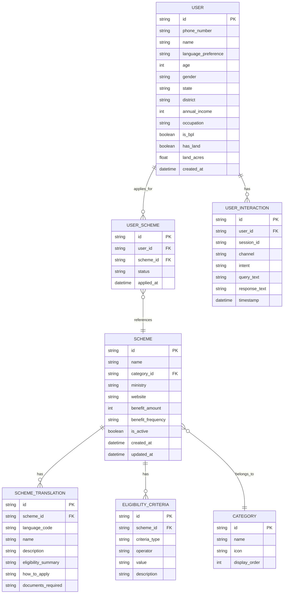
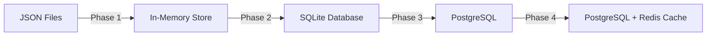

# HIMAYA - Database Schema

## Entity Relationship Diagram



## Table Definitions

### 1. Schemes Table

| Column | Type | Description |
|--------|------|-------------|
| id | VARCHAR(50) | Primary key, e.g., "pm-kisan" |
| name | VARCHAR(200) | Scheme name in English |
| category_id | VARCHAR(50) | FK to categories |
| ministry | VARCHAR(200) | Responsible ministry |
| website | VARCHAR(500) | Official scheme URL |
| benefit_amount | INTEGER | Benefit value in INR |
| benefit_frequency | ENUM | 'one-time', 'monthly', 'yearly' |
| is_active | BOOLEAN | Whether scheme is active |
| created_at | DATETIME | Record creation time |
| updated_at | DATETIME | Last update time |

### 2. Eligibility Criteria Table

| Column | Type | Description |
|--------|------|-------------|
| id | VARCHAR(50) | Primary key |
| scheme_id | VARCHAR(50) | FK to schemes |
| criteria_type | VARCHAR(50) | 'age', 'income', 'occupation', 'gender', 'bpl', 'land' |
| operator | VARCHAR(10) | 'eq', 'lt', 'gt', 'lte', 'gte', 'in', 'contains' |
| value | VARCHAR(200) | Comparison value (JSON for arrays) |
| description | VARCHAR(500) | Human-readable description |

**Criteria Examples:**
```json
// Age between 18-60
{ "criteria_type": "age", "operator": "gte", "value": "18" }
{ "criteria_type": "age", "operator": "lte", "value": "60" }

// Income less than 2.5 lakh
{ "criteria_type": "income", "operator": "lt", "value": "250000" }

// Must be farmer
{ "criteria_type": "occupation", "operator": "in", "value": "[\"farmer\", \"agricultural_laborer\"]" }

// Must have BPL card
{ "criteria_type": "bpl", "operator": "eq", "value": "true" }
```

### 3. Categories Table

| id | name | icon | display_order |
|----|------|------|---------------|
| agriculture | Agriculture | 🌾 | 1 |
| healthcare | Healthcare | 🏥 | 2 |
| education | Education | 📚 | 3 |
| housing | Housing | 🏠 | 4 |
| women-child | Women & Child | 👩‍👧 | 5 |
| employment | Employment | 💼 | 6 |
| social-security | Social Security | 🛡️ | 7 |
| financial | Financial Inclusion | 💰 | 8 |

### 4. Users Table

| Column | Type | Description |
|--------|------|-------------|
| id | VARCHAR(50) | UUID primary key |
| phone_number | VARCHAR(15) | User's phone (indexed) |
| name | VARCHAR(200) | User's name |
| language_preference | VARCHAR(10) | 'en', 'hi', etc. |
| age | INTEGER | User's age |
| gender | ENUM | 'male', 'female', 'other' |
| state | VARCHAR(100) | State of residence |
| district | VARCHAR(100) | District |
| annual_income | INTEGER | Annual income in INR |
| occupation | VARCHAR(100) | Primary occupation |
| is_bpl | BOOLEAN | Has BPL card |
| has_land | BOOLEAN | Owns agricultural land |
| land_acres | DECIMAL | Land area in acres |
| created_at | DATETIME | Registration time |

## Sample Data

### Schemes (JSON Format)

```json
[
  {
    "id": "pm-kisan",
    "name": "PM-KISAN",
    "category_id": "agriculture",
    "ministry": "Ministry of Agriculture & Farmers Welfare",
    "website": "https://pmkisan.gov.in",
    "benefit_amount": 6000,
    "benefit_frequency": "yearly",
    "is_active": true,
    "eligibility": [
      { "type": "occupation", "operator": "in", "value": ["farmer"] },
      { "type": "land", "operator": "gt", "value": 0 }
    ],
    "translations": {
      "en": {
        "name": "PM-KISAN Samman Nidhi",
        "description": "Direct income support of ₹6,000 per year to farmer families",
        "eligibility_summary": "Small and marginal farmers with cultivable land",
        "how_to_apply": "Visit nearest CSC or apply online at pmkisan.gov.in",
        "documents": ["Aadhaar Card", "Land Records", "Bank Passbook"]
      },
      "hi": {
        "name": "पीएम-किसान सम्मान निधि",
        "description": "किसान परिवारों को प्रति वर्ष ₹6,000 की प्रत्यक्ष आय सहायता",
        "eligibility_summary": "खेती योग्य भूमि वाले छोटे और सीमांत किसान",
        "how_to_apply": "नजदीकी CSC जाएं या pmkisan.gov.in पर ऑनलाइन आवेदन करें",
        "documents": ["आधार कार्ड", "भूमि रिकॉर्ड", "बैंक पासबुक"]
      }
    }
  },
  {
    "id": "ayushman-bharat",
    "name": "Ayushman Bharat PM-JAY",
    "category_id": "healthcare",
    "ministry": "Ministry of Health & Family Welfare",
    "website": "https://pmjay.gov.in",
    "benefit_amount": 500000,
    "benefit_frequency": "yearly",
    "is_active": true,
    "eligibility": [
      { "type": "income", "operator": "lt", "value": 500000 },
      { "type": "bpl", "operator": "eq", "value": true }
    ],
    "translations": {
      "en": {
        "name": "Ayushman Bharat PM-JAY",
        "description": "Health insurance of ₹5 lakh per family for secondary and tertiary care",
        "eligibility_summary": "BPL families and low-income households",
        "how_to_apply": "Visit empanelled hospital with Aadhaar or any ID proof",
        "documents": ["Aadhaar Card", "Ration Card", "Any Government ID"]
      },
      "hi": {
        "name": "आयुष्मान भारत पीएम-जय",
        "description": "परिवार को ₹5 लाख का स्वास्थ्य बीमा",
        "eligibility_summary": "BPL परिवार और कम आय वाले घर",
        "how_to_apply": "आधार या किसी भी ID के साथ पंजीकृत अस्पताल जाएं",
        "documents": ["आधार कार्ड", "राशन कार्ड", "कोई भी सरकारी ID"]
      }
    }
  }
]
```

## Indexes

```sql
-- Performance indexes
CREATE INDEX idx_schemes_category ON schemes(category_id);
CREATE INDEX idx_schemes_active ON schemes(is_active);
CREATE INDEX idx_users_phone ON users(phone_number);
CREATE INDEX idx_eligibility_scheme ON eligibility_criteria(scheme_id);
CREATE INDEX idx_translations_scheme_lang ON scheme_translations(scheme_id, language_code);
CREATE INDEX idx_interactions_user ON user_interactions(user_id, timestamp);
```

## Data Migration Path


