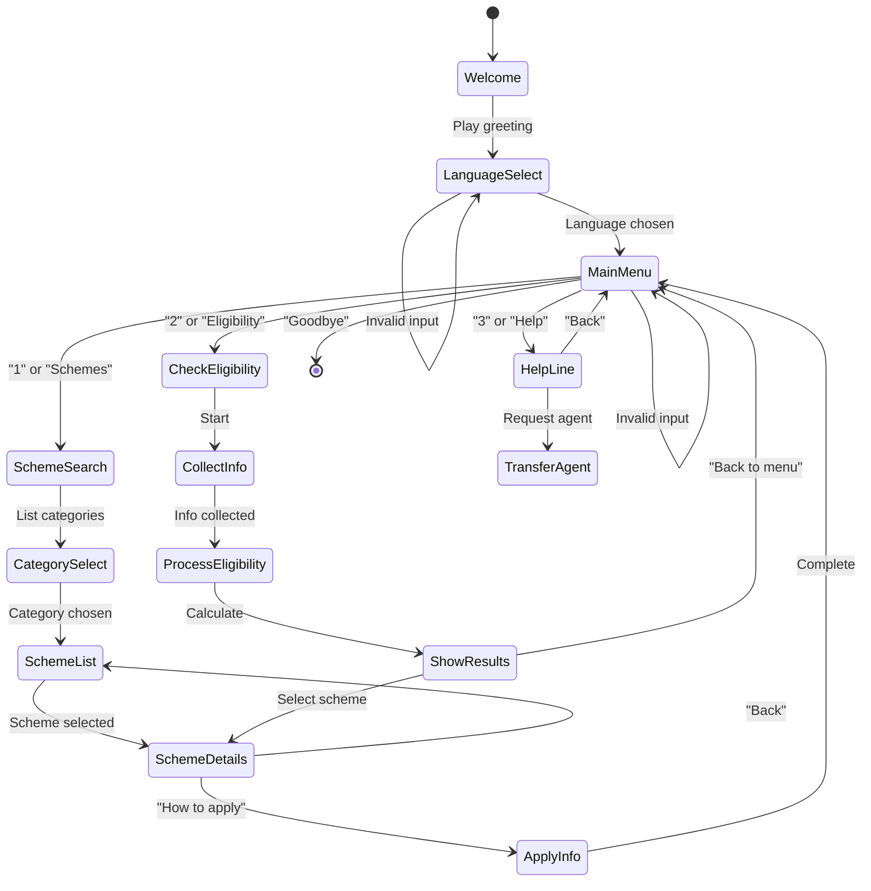
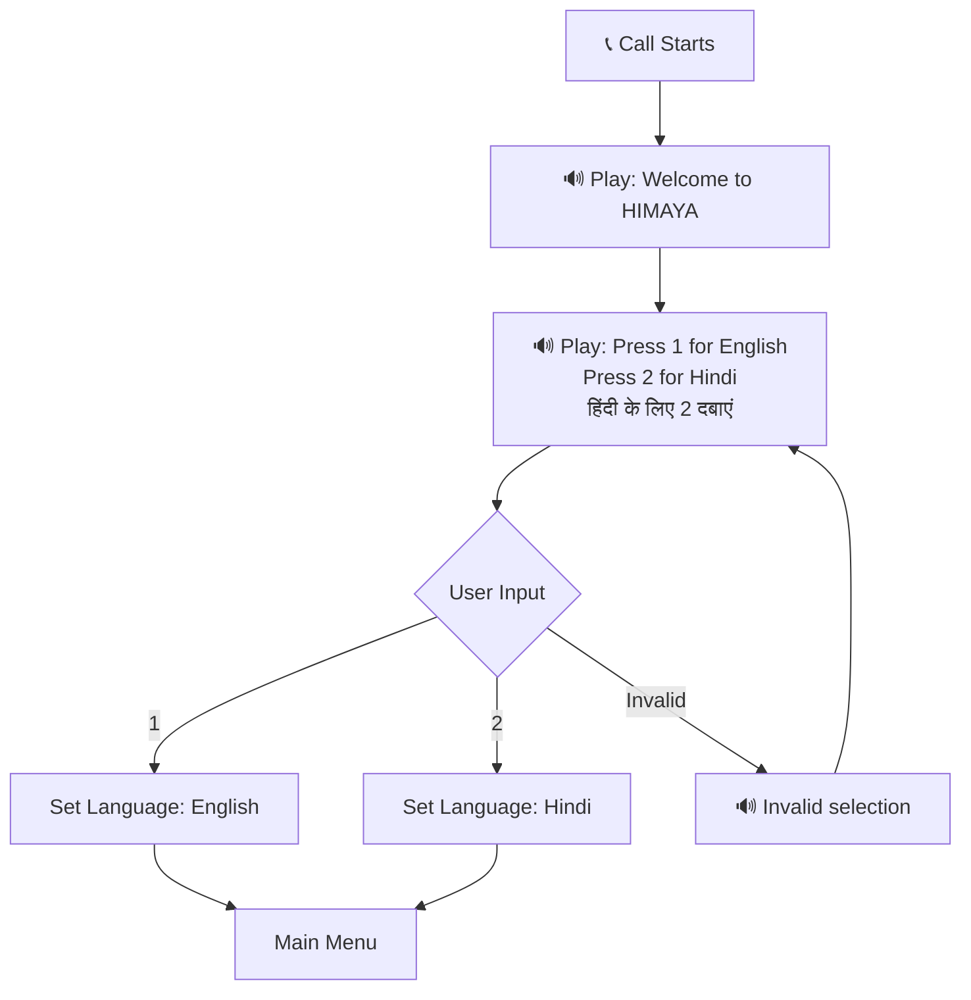
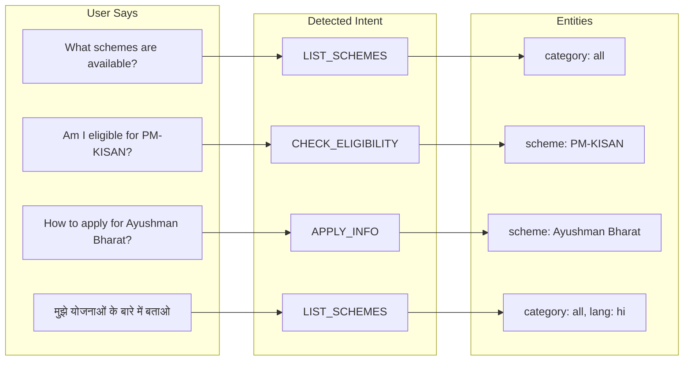
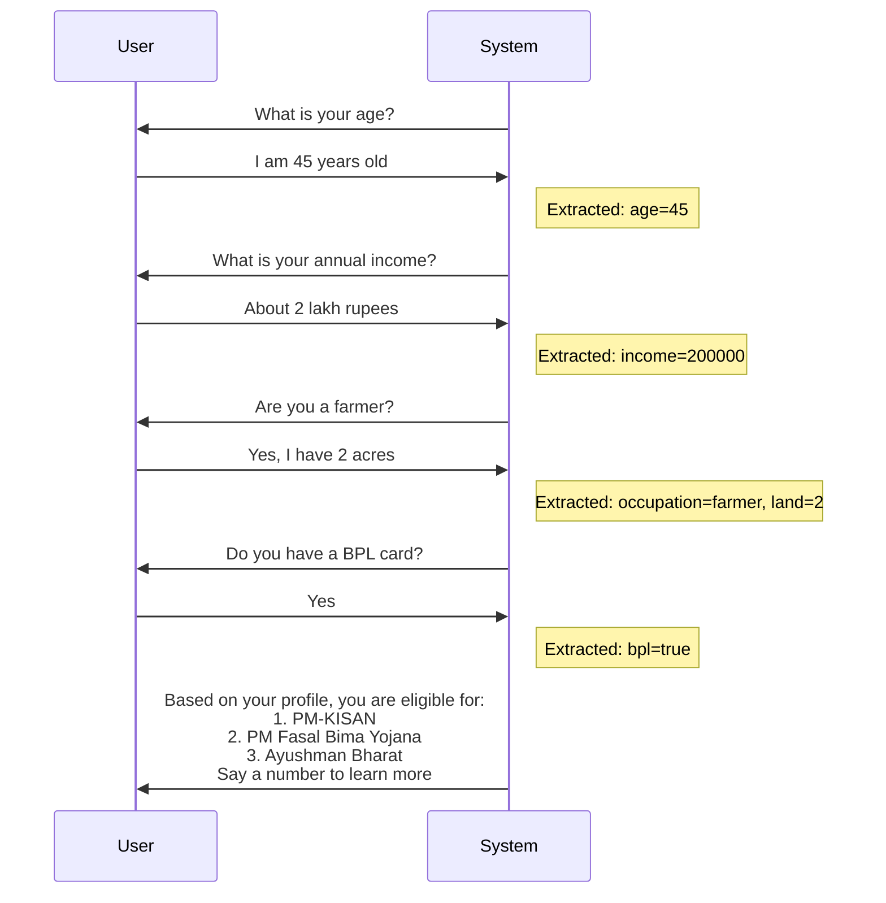
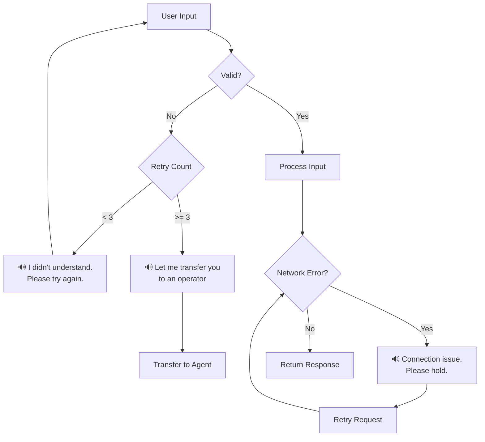

# HIMAYA - IVR Flow Design

## Main Conversation Flow



## Language Selection Flow



## Voice Intent Recognition



## Eligibility Check Conversation



## Error Handling Flow



## DTMF Keypad Mapping

| Key | Main Menu | Category Select | Scheme List |
|-----|-----------|-----------------|-------------|
| 1 | Browse Schemes | Agriculture | First scheme |
| 2 | Check Eligibility | Healthcare | Second scheme |
| 3 | Help/Support | Education | Third scheme |
| 4 | Change Language | Housing | Fourth scheme |
| 5 | - | Women & Child | Fifth scheme |
| 0 | Repeat Menu | Back | Back |
| * | Transfer to Agent | Transfer | Transfer |
| # | End Call | Main Menu | Main Menu |

## Sample Dialogues

### English - Scheme Inquiry
```
SYSTEM: Welcome to HIMAYA, your government scheme assistant.
        Press 1 for English. Hindi ke liye 2 dabaye.

USER:   1

SYSTEM: Main menu. Say "schemes" to browse schemes,
        "eligibility" to check what you qualify for,
        or "help" for assistance.

USER:   What schemes are available for farmers?

SYSTEM: I found 5 schemes for farmers:
        1. PM-KISAN - Direct income support of 6000 per year
        2. PM Fasal Bima - Crop insurance scheme
        3. Kisan Credit Card - Easy agricultural loans
        Say a number to learn more, or say "back" for main menu.

USER:   Tell me about PM-KISAN

SYSTEM: PM-KISAN provides 6000 rupees per year to farmer families,
        paid in 3 installments. To apply, you need:
        - Aadhaar card
        - Land ownership documents
        - Bank account
        Visit your nearest CSC center or apply online at pmkisan.gov.in
        Say "eligibility" to check if you qualify, or "back" for more schemes.
```

### Hindi - Eligibility Check
```
SYSTEM: हिमाया में आपका स्वागत है।
        कृपया अपनी भाषा चुनें। English के लिए 1, हिंदी के लिए 2 दबाएं।

USER:   2

SYSTEM: मुख्य मेनू। योजनाएं देखने के लिए "योजनाएं" बोलें,
        पात्रता जांचने के लिए "पात्रता" बोलें।

USER:   मेरी पात्रता जांचें

SYSTEM: मैं आपकी पात्रता जांचने में मदद करूंगा।
        कृपया अपनी उम्र बताएं।

USER:   पैंतालीस साल

SYSTEM: आपकी वार्षिक आय कितनी है?

USER:   दो लाख के करीब

SYSTEM: क्या आप किसान हैं?

USER:   हां, मेरे पास दो एकड़ जमीन है

SYSTEM: आपकी जानकारी के आधार पर, आप इन योजनाओं के लिए पात्र हैं:
        1. पीएम-किसान - सालाना 6000 रुपये
        2. आयुष्मान भारत - 5 लाख का स्वास्थ्य बीमा
        अधिक जानने के लिए नंबर बोलें।
```
