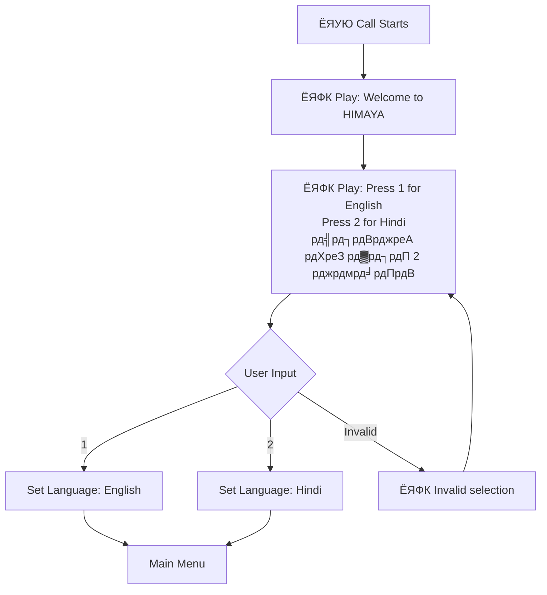
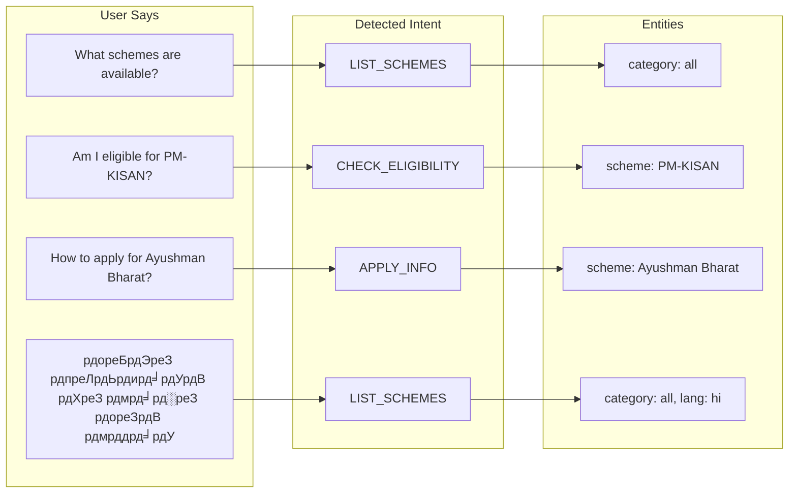
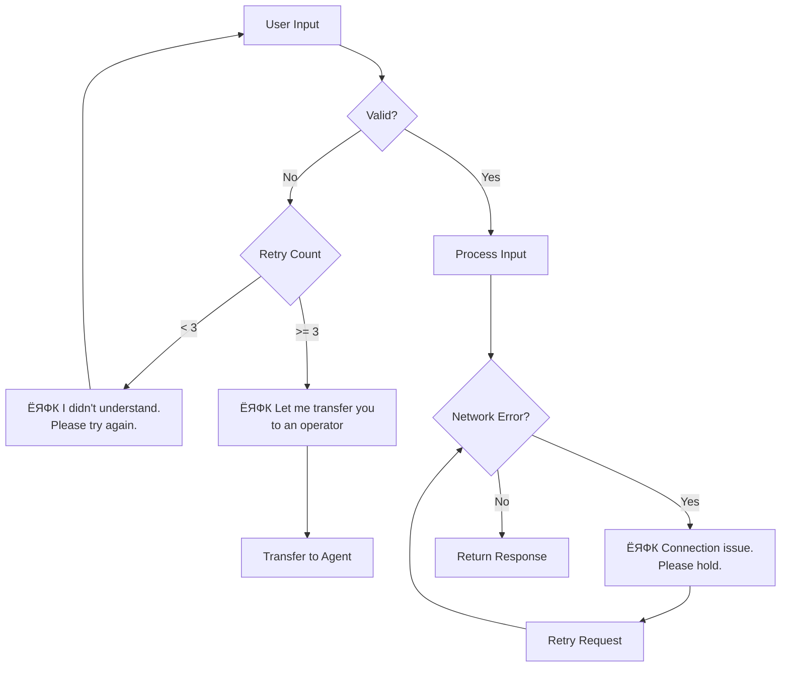

# HIMAYA - IVR Flow Design

## Main Conversation Flow


## Language Selection Flow



## Voice Intent Recognition



## Eligibility Check Conversation


## Error Handling Flow



## DTMF Keypad Mapping

| Key | Main Menu | Category Select | Scheme List |
|-----|-----------|-----------------|-------------|
| 1 | Browse Schemes | Agriculture | First scheme |
| 2 | Check Eligibility | Healthcare | Second scheme |
| 3 | Help/Support | Education | Third scheme |
| 4 | Change Language | Housing | Fourth scheme |
| 5 | - | Women & Child | Fifth scheme |
| 0 | Repeat Menu | Back | Back |
| * | Transfer to Agent | Transfer | Transfer |
| # | End Call | Main Menu | Main Menu |

## Sample Dialogues

### English - Scheme Inquiry
```
SYSTEM: Welcome to HIMAYA, your government scheme assistant.
        Press 1 for English. Hindi ke liye 2 dabaye.

USER:   1

SYSTEM: Main menu. Say "schemes" to browse schemes,
        "eligibility" to check what you qualify for,
        or "help" for assistance.

USER:   What schemes are available for farmers?

SYSTEM: I found 5 schemes for farmers:
        1. PM-KISAN - Direct income support of 6000 per year
        2. PM Fasal Bima - Crop insurance scheme
        3. Kisan Credit Card - Easy agricultural loans
        Say a number to learn more, or say "back" for main menu.

USER:   Tell me about PM-KISAN

SYSTEM: PM-KISAN provides 6000 rupees per year to farmer families,
        paid in 3 installments. To apply, you need:
        - Aadhaar card
        - Land ownership documents
        - Bank account
        Visit your nearest CSC center or apply online at pmkisan.gov.in
        Say "eligibility" to check if you qualify, or "back" for more schemes.
```

### Hindi - Eligibility Check
```
SYSTEM: рд╣рд┐рдорд╛рдпрд╛ рдореЗрдВ рдЖрдкрдХрд╛ рд╕реНрд╡рд╛рдЧрдд рд╣реИред
        рдХреГрдкрдпрд╛ рдЕрдкрдиреА рднрд╛рд╖рд╛ рдЪреБрдиреЗрдВред English рдХреЗ рд▓рд┐рдП 1, рд╣рд┐рдВрджреА рдХреЗ рд▓рд┐рдП 2 рджрдмрд╛рдПрдВред

USER:   2

SYSTEM: рдореБрдЦреНрдп рдореЗрдиреВред рдпреЛрдЬрдирд╛рдПрдВ рджреЗрдЦрдиреЗ рдХреЗ рд▓рд┐рдП "рдпреЛрдЬрдирд╛рдПрдВ" рдмреЛрд▓реЗрдВ,
        рдкрд╛рддреНрд░рддрд╛ рдЬрд╛рдВрдЪрдиреЗ рдХреЗ рд▓рд┐рдП "рдкрд╛рддреНрд░рддрд╛" рдмреЛрд▓реЗрдВред

USER:   рдореЗрд░реА рдкрд╛рддреНрд░рддрд╛ рдЬрд╛рдВрдЪреЗрдВ

SYSTEM: рдореИрдВ рдЖрдкрдХреА рдкрд╛рддреНрд░рддрд╛ рдЬрд╛рдВрдЪрдиреЗ рдореЗрдВ рдорджрдж рдХрд░реВрдВрдЧрд╛ред
        рдХреГрдкрдпрд╛ рдЕрдкрдиреА рдЙрдореНрд░ рдмрддрд╛рдПрдВред

USER:   рдкреИрдВрддрд╛рд▓реАрд╕ рд╕рд╛рд▓

SYSTEM: рдЖрдкрдХреА рд╡рд╛рд░реНрд╖рд┐рдХ рдЖрдп рдХрд┐рддрдиреА рд╣реИ?

USER:   рджреЛ рд▓рд╛рдЦ рдХреЗ рдХрд░реАрдм

SYSTEM: рдХреНрдпрд╛ рдЖрдк рдХрд┐рд╕рд╛рди рд╣реИрдВ?

USER:   рд╣рд╛рдВ, рдореЗрд░реЗ рдкрд╛рд╕ рджреЛ рдПрдХрдбрд╝ рдЬрдореАрди рд╣реИ

SYSTEM: рдЖрдкрдХреА рдЬрд╛рдирдХрд╛рд░реА рдХреЗ рдЖрдзрд╛рд░ рдкрд░, рдЖрдк рдЗрди рдпреЛрдЬрдирд╛рдУрдВ рдХреЗ рд▓рд┐рдП рдкрд╛рддреНрд░ рд╣реИрдВ:
        1. рдкреАрдПрдо-рдХрд┐рд╕рд╛рди - рд╕рд╛рд▓рд╛рдирд╛ 6000 рд░реБрдкрдпреЗ
        2. рдЖрдпреБрд╖реНрдорд╛рди рднрд╛рд░рдд - 5 рд▓рд╛рдЦ рдХрд╛ рд╕реНрд╡рд╛рд╕реНрдереНрдп рдмреАрдорд╛
        рдЕрдзрд┐рдХ рдЬрд╛рдирдиреЗ рдХреЗ рд▓рд┐рдП рдирдВрдмрд░ рдмреЛрд▓реЗрдВред
```
